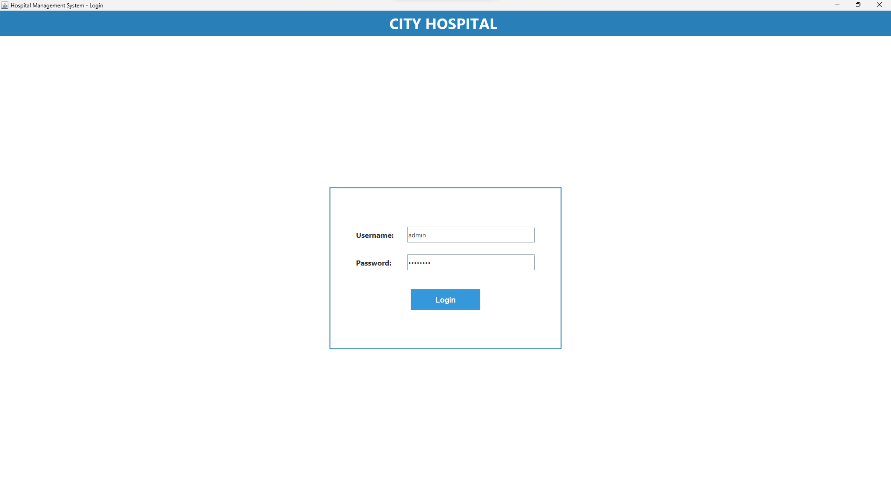
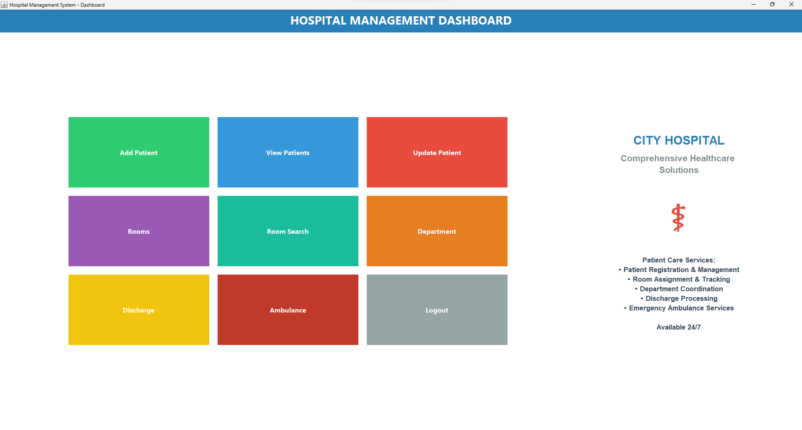

# 🏥 Hospital Management System

A desktop-based Java application designed to simplify and automate hospital data management — from patient records to room allocation and ambulance tracking. It provides a clean and interactive user interface for managing hospital operations efficiently.

## 🚀 Features

- Secure **login system** with credential validation  
- **Patient management**: add, update, view, or discharge patients  
- **Room management**: track available and occupied rooms  
- **Ambulance module**: request and monitor ambulance status  
- **Department dashboard** with live status updates  
- Real-time data storage and retrieval through **MySQL database**  

## 🛠️ Tech Stack

- Language: Java
- UI Frameworks: Swing, AWT
- Database Connectivity: JDBC
- Database: MySQL

## 📸 Screenshots

| Login Page                      | Dashboard                          |
| ------------------------------- | ---------------------------------- |
|  |  |

## 📦 How to Run

 1. Open project in any Java IDE (e.g., VS Code, IntelliJ, or Eclipse)

 2. Connect to your MySQL database
    - Create a database (e.g., hospital_db)
    - Update connection details in the code:
    - url = "jdbc:mysql://localhost:3306/hospital_db"
    - username = "root"
    - password = "your_password"

3. Compile and run the project

## 💡 Future Enhancements

- Add admin and staff roles with access control
- Include data visualization dashboards
- Integrate SMS/email alerts for patients and departments
